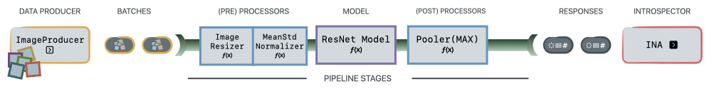

.. _architecture_overview:

============================
DNIKit Architecture Overview
============================

This page contains an overview of the DNIKit architecture and how pieces work together. Please see
the following three pages for more detailed information:

2. :ref:`Load a model <connect_your_model>`
3. :ref:`Load data <connect_your_data>`
4. :ref:`Introspect <how_to_introspect>`

Architecture
~~~~~~~~~~~~

          is fed through the entire pipeline, from Producer to Introspector.

DNIKit begins with a :class:`Producer <dnikit.base.Producer>` that is in
charge of generating :class:`Batches <dnikit.base.Batch>` of data for the rest of DNIKit to process
or consume.

DNIKit only loads, processes and consumes data when it needs to. This is known as
`lazy evaluation <https://en.wikipedia.org/wiki/Lazy_evaluation>`_. Using lazy evaluation
avoids processing, running inference and analyzing the full dataset in one fell swoop, as these
operations can easily require more than the system's available memory.

Instead, a :class:`Producer <dnikit.base.Producer>` generates small
:class:`Batches <dnikit.base.Batch>` of data, which can be processed and analyzed with the
available memory as part of a DNIKit :class:`pipeline <dnikit.base.pipeline>`. A
:func:`pipeline <dnikit.base.pipeline>` is a
composition of :class:`Batch <dnikit.base.Batch>` transformations that we call
:class:`PipelineStages <dnikit.base.PipelineStage>`.

Example :class:`PipelineStages <dnikit.base.PipelineStage>` could be various pre- or post-
:class:`Processors <dnikit.processors.Processor>`, or :class:`Model <dnikit.base.Model>` inference.
These all apply transformations to a :class:`Batch <dnikit.base.Batch>` and output a new
:class:`Batch <dnikit.base.Batch>` (typically model responses).

Finally, DNIKit's :class:`Introspectors <dnikit.base.Introspector>` will analyze input
:class:`Batches <dnikit.base.Batch>` (usually :class:`Batches <dnikit.base.Batch>` of model
responses) to provide insights about the dataset and/or model.

Below shows a generic and example DNIKit pipeline setup.

**GENERIC**

          batches (one batch at a time). The Batch then goes through various optional
          Pipeline Stages, including two Processors (pre and post) and one Model inference.
          The transformed Batch is then fed into the Introspector.

**EXAMPLE**

          yields batches of images (one batch at a time). The Batch then goes through various
          Pipeline Stages: First an Image Resizer, then a Mean / Std Normalizer, ResNet Model
          inference, and a Pooler. At this point, the Batches contain pooled model responses, and
          they are (one at a time) fed into the IUA introspector.

See the next sections in these **How To Guides** for information about each of DNIKit's components.
