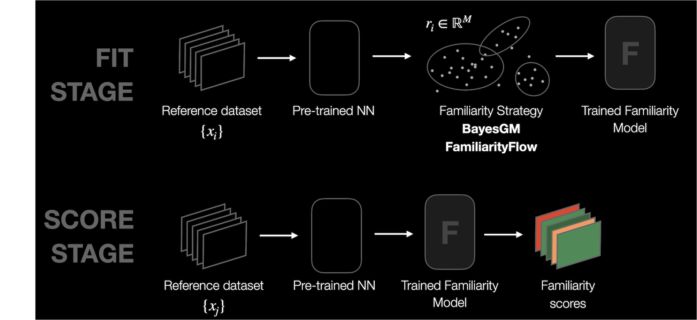

.. _familiarity:

===========
Familiarity
===========

Familiarity quantifies how *familiar* a data point is to a specific dataset
or subset, by fitting a probability distribution to the activations of the specified layer(s),
and then evaluating the probability of any data sample according to the distribution.

Familiarity can be used to:

* :ref:`Discover the least and most representative data samples in a dataset or subset <Use Case - Finding Dataset Errors>`
* :ref:`Compare distributions of different datasets to analyze test / train splits, evaluate synthetic datasets, and more <Use Case - Comparing Dataset Distributions>`
* **Active learning**: Use familiarity score to guide data sampling for training.
* **Dataset sampling**: Modify the sampling strategy during training by sampling data
  according the the familiarity score (sample more frequently points with low score,
  and less frequently those that have high familiarity)
* **Weighted model training**: Compute a weight that is inversely proportional to the
  familiarity score for each data sample so that such score can be used in the loss function
  (this can be used for training DNNs with unbalanced datasets).

`Familiarity` is also used in the :ref:`Dataset Report <dataset_report>` to find the least and most
representative data samples, in order to spot outliers, find dataset errors, and analyze data bias.
`Familiarity` can be used on the overall dataset, or applied to subgroups of the data.

Please see the :ref:`full description of the algorithm below <alg-familiarity>`.

General Usage
-------------

For getting started with DNIKit code, please see the :ref:`how-to pages <connect_your_model>`.

Assuming a :func:`pipeline <dnikit.base.pipeline>` is
set up to produce responses from a model,
:class:`Familiarity <dnikit.introspectors.Familiarity>` can be run like so:

.. code-block:: python

   from dnikit.introspectors import Familiarity

   producer = ...  # pipeline setup here

   # Run Familiarity analysis on responses from a producer
   familiarity = Familiarity.introspect(producer, batch_size=128)

Preparing input to introspection usually requires two things:

* introspect on **intermediate layer responses** (rather than the final outputs of a network).
  For `Familiarity`, the layer used will affect what kinds of features the probability
  distribution will represent. For example, a layer at the end of the network for a classification
  model will yield a Familiarity model that looks at the high level representation of the data
  sample: e.g. grouping similar classes together. A layer extracted from the beginning of the
  network might lead to a Familiarity model built around lower-level data sample information,
  e.g., sensor artifacts, image brightness, shape, etc. for visual data.
* **reduce the dimensions** of outputs
  with a :ref:`dimension reduction algorithm <dimension_reduction>`.
  This helps with the performance of the :ref:`Familiarity algorithm <alg-familiarity>`,
  which tries to capture the "dense" areas of a dataset.

`Familiarity` is slightly different than other introspectors, in that it returns
a probability *model* instead of a concrete result (a Gaussian mixture model (GMM) built around the
input data, see :ref:`below <alg-familiarity>`).
To compute `Familiarity` score for each data sample, or the probability of a data sample according
to the GMM, the built model in a DNIKit
:class:`pipeline <dnikit.base.pipeline>` will need to be applied to the data to be scored.

Full example
~~~~~~~~~~~~

A full example pipeline for the CIFAR10 dataset, using `Familiarity` to fit a probability
distribution to the data samples with label "deer", and then computing familiarity
scores for all "deer" data. This is an example of applying `Familiarity` to analyzing a dataset
for the least and most representative data samples, using a model not trained on the target data
(MobileNet model trained on the ImageNet dataset).

.. code-block:: python

   from dnikit_tensorflow import TFDatasetExamples, TFModelExamples
   from dnikit.introspectors import Familiarity, DimensionReduction
   from dnikit.processors import Cacher, ImageResizer
   from dnikit.base import pipeline

   # Load CIFAR10 dataset and feed into MobileNet,
   # observing responses from layer conv_pw_13
   cifar10 = TFDatasetExamples.CIFAR10(attach_metadata=True)
   cifar10_deers = cifar10.subset(labels=["deer"])
   mobilenet = TFModelExamples.MobileNet()
   producer = pipeline(
      cifar10_deers,
      ImageResizer(pixel_format=ImageResizer.Format.HWC, size=(224, 224)),
      mobilenet(requested_responses=['conv_pw_13/convolution:0']),
      Cacher()
   )

   # Create a processor that reduces dimensions of
   # model responses down to 40, using PCA
   pca = DimensionReduction.introspect(
       producer,
       strategies=DimensionReduction.Strategy.PCA(40)
   )

   # Create a new producer that outputs the reduced data:
   reduced_producer = pipeline(producer, pca)

   # Run Familiarity introspector
   familiarity = Familiarity.introspect(reduced_producer, batch_size=64)

.. Note:: All data samples could also be scored according to the Familiarity model instead of just
   the deer data, which would indicate which data samples in the overall dataset are most similar to
   deer according to the model and which data samples are least similar.

Exploring results
~~~~~~~~~~~~~~~~~

:class:`Familiarity.introspect <dnikit.base.introspectors.Familiarity>` returns
a *model* instead of a concrete result. For the result to be useful, data must be *scored*
by feeding it through the familiarity model; e.g., in the context of the earlier example code:

.. code-block:: python

    scored_producer = pipeline(reduced_producer, familiarity)

This will attach metadata to each :class:`Batch <dnikit.base.Batch>` of data
containing the scores for each sample, accessed via the metadata :code:`familiarity.meta_key`:

.. code-block:: python

    for batch in scored_producer(batch_size=8):
        for response_name, scores in batch.metadata[familiarity.meta_key].items():
            print(response_name, scores)

The scoring is a separate step from the initial `Familiarity` model creation because:

1. Data can be scored in batches, improving efficiency for large datasets
2. The Familiarity model can score alternative data to what the model was fit on; for instance,
   to determine the most "five-like" threes in MNIST, or how close non-car CIFAR10 classes appear
   to "automobiles" (it's likely trucks will come first, animal classes last).

.. Note:: Familiarity may also be run as part of the
   :ref:`Dataset Report <dataset_report>` and explored interactively with the `Symphony UI <https://github.com/apple/ml-symphony>`_.

Familiarity strategies
~~~~~~~~~~~~~~~~~~~~~~

:class:`Familiarity.introspect <dnikit.introspectors.Familiarity.introspect>` accepts
a ``strategy`` keyword argument that can be either the
:class:`Familiarity.Strategy.GMM <dnikit.introspectors.Familiarity.Strategy.GMM>` strategy
or a custom strategy that follows the
:class:`FamiliarityStrategyType <dnikit.introspectors.FamiliarityStrategyType>` protocol.
See below for more information about each.

GMM (Gaussian Mixture Model)
****************************

Fits a multivariate Gaussian Mixture Model.
:class:`GMM <dnikit.introspectors.Familiarity.Strategy.GMM>` is a parametric density
estimation method.

The most important parameter is the number of gaussians (``gaussian_count``) to be learned. A
``convergence_threshold`` can also be set that will indicate at which accuracy level the
fitting should stop (the lower the more accurate, but longer fitting time). Additionally, the
number of fitting iterations can be set through ``max_iterations``.

The :class:`GMM <dnikit.introspectors.Familiarity.Strategy.GMM>` strategy is suitable when it's
known that the underlying PDF might be Gaussian (or close). However, for PDFs that are strongly
non-gaussian, a non-parametric approach might be more suitable.

It's recommended to fit a DMM with diagonal covariance
(:class:`DIAG <dnikit.introspectors.GMMCovarianceType.DIAG>`) when the data dimensionality is high,
to avoid overfitting and numerical instabilities. Else, use full covariance
(:class:`FULL <dnikit.introspectors.GMMCovarianceType.FULL>`).

Code sample for :class:`GMM <dnikit.introspectors.Familiarity.Strategy.GMM>` familiarity
with typical parameters:

.. code-block:: python

    familiarity = Familiarity.introspect(
        producer=response_producer,
        strategy=Familiarity.Strategy.GMM(
            gaussian_count=5,
            covariance_type=GMMCovarianceType.DIAG,
            convergence_threshold=1e-3,
            max_iterations=200,
        )
    )

Custom Strategy
***************
It is also possible to define a custom Familiarity strategy that follows the
:class:`FamiliarityStrategyType <dnikit.introspectors.FamiliarityStrategyType>` protocol.

.. _description-familiarity:

Description
-----------

Use Case - Finding Dataset Errors
~~~~~~~~~~~~~~~~~~~~~~~~~~~~~~~~~
Knowing which data points are seen as rare by a ML model and which data
points have been wrongly annotated is crucial to improve model accuracy
and robustness. However, inspecting datasets can become an overwhelming
task as their size and complexity grows. Moreover, an ML dataset is
coupled with the model that *learns* from it, and this dependency
should not be omitted during data inspection, since it is the model that
will make the final decisions.

DNIKit's `Familiarity` introspector finds the most/least
representative data samples in a given dataset or within a certain class.
Instead of learning the distribution of the raw data, it learns the
**distribution of the embedding space** generated by a layer of a DNN
when performing inference on the dataset. Different layers capture different
levels of information about the input data, and therefore, Familiarity will
perform differently depending on the layer chosen.

Sometimes, for practical reasons, it is advisable to reduce the
dimensionality of the representations using a
:class:`dimension reduction <dnikit.introspectors.DimensionReduction>`
algorithm. Typical values for the reduced dimensionality are between 40 and 100,
but it depends on the use case.

The Familiarity model is fit using a dataset's representation in embedding space,
known as the model responses. The fitted model can evaluate (*score*) the
probability for each data sample (or new data samples),
where each data point :math:`\mathbf{x}_i` gets a score
(negative log likelihood) that tells us how dense the dataset is at embedding
space position :math:`\mathbf{x}_i`.

Familiarity scores are useful to identify anomalies in a dataset, such as:

* Wrongly labelled data, typically have a very low familiarity score.
* Rare data / edge cases:

  * can be data that is not wanted in the dataset (eg. noisy data),
  * or data that should be better represented in the dataset, in that case
    the anomalies can guide new annotation rounds.

For finding errors within a subgroup of data, it is helpful to perform familiarity analysis
for that given subgroup alone, instead of evaluating the entire dataset at once.

Use Case - Comparing Dataset Distributions
~~~~~~~~~~~~~~~~~~~~~~~~~~~~~~~~~~~~~~~~~~
If the train and test sets are from different distributions, then the model would be learning on
data that are not representative of the real world scenario that are being tested. Similarly, a gap
in distributions from two different datasets, e.g. synthetic vs. real datasets, or a new batch of
data collection, can introduce problems during model training or evaluation.

Comparing the distribution of two (or more) different datasets can help to expose a hidden problem,
such as with the following comparisons:

1. **Train & test datasets**: A gap indicates that the model will be / has been trained on data that
   are not representative of the real world scenario, as defined by the test dataset.
2. **Original dataset with new data**: A gap indicates that it's necessary to review the datasets to
   learn why their distributions are different, if they're intended to have the same distribution.
3. **Real & synthetic datasets**: A gap indicates that the synthetic data is not similar enough
   to the real data, as seen through the eyes of the network.

To understand the root of these problems, `Familiarity` is one tool available, which
finds the data samples that are most unfamiliar in one dataset, when compared to the other:
:ref:`Dataset errors / rare samples <Use Case - Finding Dataset Errors>`.

To quantify the distribution, familiarity likelihood is measured as
(:math:`\mathcal{L}_{f \rightarrow p}`) from :math:`D_f=` `DATASET_FIT`
to :math:`D_p=` `DATASET_PREDICT`:

.. math::
    \mathcal{L}_{f \rightarrow p} = \frac{\mathcal{F}(D_f, D_p)}{\mathcal{F}(D_f, D_f)}\qquad\mathcal{L}_{f \rightarrow p} > 0

- If :math:`\mathcal{L}_{f \rightarrow p}` is below 0.6, there is a huge gap, and one of the
  datasets is likely in need of being re-collected.

- If :math:`\mathcal{L}_{f \rightarrow p}` is between 0.6 and 0.8, then there's a small gap,
  but worth further inspection.

- If :math:`\mathcal{L}_{f \rightarrow p}` is between 0.8 and 1.2, then there is not a
  significant gap between the datasets, and all looks good.

- If :math:`\mathcal{L}_{f \rightarrow p}` exceeds 1.2, there is a gap, and worth further
  inspection, with a possible re-collection of one of the datasets.

For the comparisons listed, here are some possible actions to take if there is a gap
in the distributions:

1. **Train & test datasets**: In order to bridge the gap, one solution could be reshuffling
   of data samples across training and test sets, or collecting more data to bring the
   distributions together. **Note:** this evaluation will not help if both the training and test
   sets are poor representations of the target use case, but hopefully other dataset errors can be
   caught with some of the other dataset analysis tools in DNIKit.
2. **Original dataset with new data**: More data can be collected to bring the distributions
   together, and further inspect the root cause of the distribution gap using `Familiarity`'s
   :ref:`Dataset errors / rare samples analysis <Use Case - Finding Dataset Errors>`.
3. **Real & synthetic datasets**: To bridge the gap, one solution would be to adjust the way that
   the synthetic data is generated, and further inspect the most unfamiliar samples using
   Familiarity's :ref:`Dataset errors / rare samples analysis <Use Case - Finding Dataset Errors>`.

To more concretely identify where there are gaps in the distribution, for datasets with class
labels, compute Familiarity likelihood for each class independently.

.. _alg-familiarity:

Algorithm
~~~~~~~~~

Knowing the probability density function (PDF or :math:`p(x)`) underlying the observed data is of
great importance for many ML domains. For example, the key idea behind algorithms like GAN or VAE
is to estimate the PDF of the data as accurately as possible. However, learning a PDF in high
dimensions is not trivial; furthermore the data available is typically limited. DNIKit provides
different strategies to learn the probability density function of a dataset, designed to work with
1D data (i.e. responses from a DNN layer). This set of strategies is called **Familiarity**.

Let the response of a DNN to a data point :math:`x_i` be :math:`r_i = \phi(x_i)`, where
:math:`\phi` represents the DNN. Familiarity can fit a density estimation model to a
dataset :math:`D` (expressed as the responses :math:`\{r_i\}`). Such model learns an estimated
:math:`\tilde{p}_{D}(r) = \tilde{p}_{D}(\phi(x))`. Note that using the responses implies learning
a distribution created *through the eyes of a DNN*.

The trained Familiarity model can then be used to assign a score to any data point
:math:`x_i`, either from the same training dataset or from a new one. The familiarity score
tells whether a specific data point lies in a dense or
non-dense area, which will be helpful for many applications.

The typical Familiarity workflow is then the following:

- Run inference on a dataset :math:`\{x_i\}` and obtain the corresponding responses
  :math:`\{r_i\}` from a given DNN layer.
- Fit a Familiarity model using :math:`\{r_i\}` and the Familiarity strategy of choice.
- Score new data (or the data used for fitting) using the model.

Being precise, the familiarity score is the negative log likelihood of the response :math:`r_i`
of a given data point :math:`x_i`:

.. math::
    \text{fam_score}(x_i) = -\log\tilde{p}_{D}(r_i) = -\log\tilde{p}_{D}(\phi(x_i)).

          scoring data according to the model to produce Familiarity scores.
    :align: center

.. _familiarity_example:

Example
-------
.. toctree::
   :maxdepth: 1

   Jupyter Notebook: Familiarity for Rare Data Discovery <../../notebooks/data_introspection/familiarity_for_rare_data_discovery.ipynb>
   Jupyter Notebook: Familiarity for Comparison of Dataset Distribution <../../notebooks/data_introspection/familiarity_for_dataset_distribution.ipynb>

Relevant API
------------

- :class:`Familiarity <dnikit.introspectors.Familiarity>`
- :class:`GMM strategy <dnikit.introspectors.Familiarity.Strategy.GMM>`
- :class:`FamiliarityStrategyType <dnikit.introspectors.FamiliarityStrategyType>`
- :class:`DimensionReduction <dnikit.introspectors.DimensionReduction>`

Useful external links
~~~~~~~~~~~~~~~~~~~~~

- `A Gentle Introduction to Probability Density Estimation <https://machinelearningmastery.com/probability-density-estimation/>`_
