.. _network_compression:

========================================================
Network Compression with Principal Filter Analysis (PFA)
========================================================

Discover highly correlated filter, or more generically unit,
responses within layers of a neural network. Guide network compression by
removing redundant filter in order to decrease inference time
and memory footprint while improving generalization.

For a more thorough discussion of this algorithm and its use, see the
:ref:`Description <pfa_description>` below.

General Usage
-------------

Assuming a :func:`pipeline <dnikit.base.pipeline>` has been
set up to produce responses from a model,
:class:`PFA <dnikit.introspectors.PFA>` can be run like so:

.. code-block:: python

   from dnikit.introspectors import PFA

   producer = ...  # pipeline setup here

   # Run PFA analysis on responses from a producer
   result = PFA.introspect(producer, batch_size=128)

For PFA, like :ref:`IUA <inactive_units>`,
inputs to introspection should be prepared by selecting which
**layer responses** to analyze for compression. For instance, for a model
that uses Conv2D layers, one option could be selecting all the responses
for those layers by reviewing the DNIKit :class:`Model`'s
:func:`.response_infos() <dnikit.base.Model.response_infos>` and passing them where the model is
used in the pipeline, e.g.:

.. code-block:: python

   dnikit_model = ... # load model here

   # Find only conv2d layer responses
   response_infos = dnikit_model.response_infos()
   conv_response_names = [
        info.name
        for info in response_infos.values()
        if info.layer.kind == ResponseInfo.LayerKind.CONV_2D
   ]

   producer = pipeline(
        dataset,
        ...
        # Tell the model which responses to look at
        dnikit_model(conv_response_names),
        ...
   )

After running PFA, the results cannot be seen yet.
Instead, the output is a new :class:`PFA <dnikit.introspectors.PFA>`
object with information attached to build a "**recipe**" using a
particular :ref:`compression strategy <pfa_config_options>`.
Here is an example of how to build and show a recipe using the default "KL" strategy:

.. code-block:: python

    recipe = pfa.get_recipe()
    PFA.show(recipe)

Other strategies, including Energy, Size, and showing specific
units to keep are explained in :ref:`Config Options <pfa_config_options>`.

**Note that PFA does not compress a network directly!** It's important to
instead retrain the network model with the suggested layer sizes.
The benefit of PFA is that it uses data passing through the model
to make smart suggestions on how to revise layer sizes while
(as much as possible) retaining accuracy.

For more detailed examples of PFA,
see the :ref:`suggested workflow <pfa_suggested_workflow>`
or :ref:`example notebooks <pfa_example>`.

Visualization
-------------

The :meth:`PFA.show <dnikit.introspectors.PFA.show>` method will by default print a table
(in a Jupyter notebook) of the suggested new layer sizes:

.. code-block:: python

    PFA.show(recipe, vis_type=PFA.VisType.TABLE)

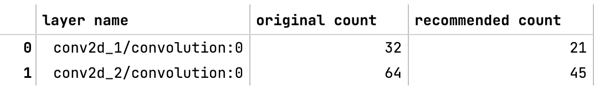
          recommended unit count for that layer.

It's also possible to use the :code:`PFA.VisType.CHART` option to display
a graph comparing recommended vs. original unit counts per layer:

.. code-block:: python

    PFA.show(recipe, vis_type=PFA.VisType.CHART)

In addition, to compare a number of different compression recipes,
it's possible to pass a list of recipes into :code:`show`:

.. code-block:: python

    recipe_KL = pfa.get_recipe()
    recipe_energy_80 = pfa.get_recipe(
        strategy=PFA.Strategy.Energy(energy_threshold=0.8, min_kept_count=3)
    )

    PFA.show([recipe_KL, recipe_energy_80])

For more options, see the :class:`API <dnikit.introspectors.PFA.show>`.

.. _pfa_config_options:

Config options
--------------

The main configuration of PFA analysis is not done on the :func:`introspect` method
directly, but in PFA's :func:`get_recipe <dnikit.introspectors.PFA.get_recipe>` method,
which is passed the return object of :func:`introspect <dnikit.introspectors.PFA.introspect>`. :func:`get_recipe <dnikit.introspectors.PFA.get_recipe>` has
a number of configuration options, named "strategies," to choose from.

PFA  Strategies
^^^^^^^^^^^^^^^
PFA has different :class:`strategies <dnikit.introspectors.PFA.Strategy>` that can be chosen in order to satisfy a specific target while identifying how many units are least correlated.
The strategies available are **PFA Size**, **PFA Energy**, and **PFA KL**.

PFA Energy
**********
PFA Energy is analogous to the idea of PCA where the user specifies the amount of *energy* that should be preserved.
Similarly, in PFA Energy the user specifies how much energy of the existing responses should be preserved
(in terms of eigenvalues of the covariance matrix). An energy of 1.0 will provide a recipe that contains almost all
current units, the closer the energy value is to 0.0 the less number of units will be suggested as non-redundant.

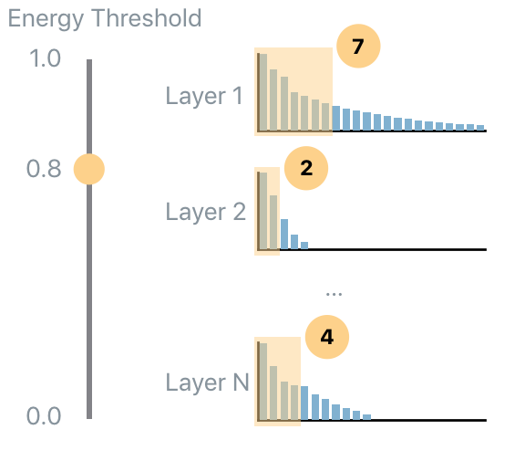

The code to use the PFA Energy with energy level equal to 0.7 of the original energy,
while ensuring that at least 3 units are always considered non-redundant is:

.. code-block:: python

    recipe_dictionary = pfa.get_recipe(
        compression=PFA.Strategy.Energy(
            energy_threshold=0.7,
            min_kept_count=3
        )
    )

PFA Size
********

PFA Size allows the user to specify the percentage of the weights (of the current model) that should be used in order to
extract the same information extracted by the current model. For example, 1.0 means use the same number of weights of
the current model, while 0.5 means that the algorithm will find the least correlated units such
that the overall number of weights is half of the weights of all analyzed layers.

The code to use the PFA Size strategy that uses 0.8 of the original weights, it ensures that at least 2 units are always
 considered non-redundant, and it ensures that at least 0.6 of the energy is preserved, is:

.. code-block:: python

    recipe_dictionary = pfa.get_recipe(
        strategy=PFA.Strategy.Size(
            relative_size=0.8,
            min_kept_count=3,
            epsilon_energy=0.6
        )
    )

PFA KL
******

PFA KL (also known as PFA-Zero) is a heuristic that does not require any user input parameter
and tries to find the number of uncorrelated units.
In order to understand how this strategy works it's important to understand
*ideal* eigenvalues set. If completely uncorrelated and equally contributing units are desired,
then the empirical eigenvalue distribution should be flat: this means that all units are
uncorrelated. The opposite scenario is when only a single eigenvalue is non-zero: this means that
the same task can be performed equivalently well by a single unit.

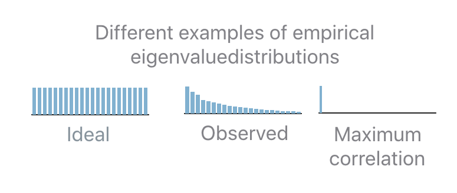
         at all. Typically there are certain layers highly correlated with others.
   :align: center

In practice the observed distribution will be in-between the two extreme cases. In order to
determine how many units should be selected given an observed distribution, PFA relies on the
*distance* (the Kullback-Leibler divergence, KL, is used) between the observed and the ideal
distribution. If the distance is 0 then all units are uncorrelated. If the distance is equal to the
distance between the maximally correlated and the ideal distribution then all units are correlated.
In all the intermediate case, PFA interpolates between the two extremes in order to map a
distance *x* to the number *b* of ``uncorrelated`` units.

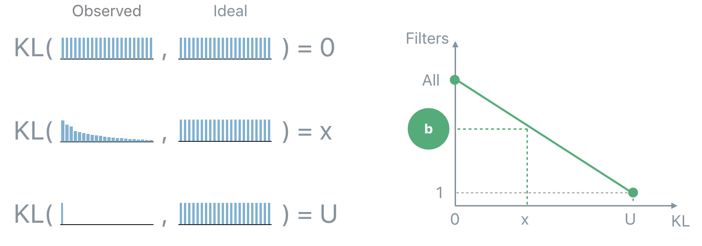
         distance x to the number b of uncorrelated units.
   :align: center

The code to use the PFA KL strategy follows:

.. code-block:: python

    recipe_dictionary = pfa.get_recipe(
        strategy=PFA.Strategy.KL()
    )

Unit Selection
^^^^^^^^^^^^^^

The recipes computed so far specify how many uncorrelated units each analyzed layer has, and provide some additional diagnostic
information that could be useful for introspection (such as the KL-divergence between the normalized eigenvalues of the covariance
matrix and the uniform distribution). However, they do not provide the information about *which* units
are uncorrelated. This task is performed by the unit selection step.

All unit selection strategies are based on the Pearson's correlation coefficients that can be extracted from the
covariance matrix computed before. The Pearson's correlation coefficients provide a measure of the strength of the
linear relationship between pairs of variables (in this case pairs of units): the higher the coefficient the
stronger the correlation.

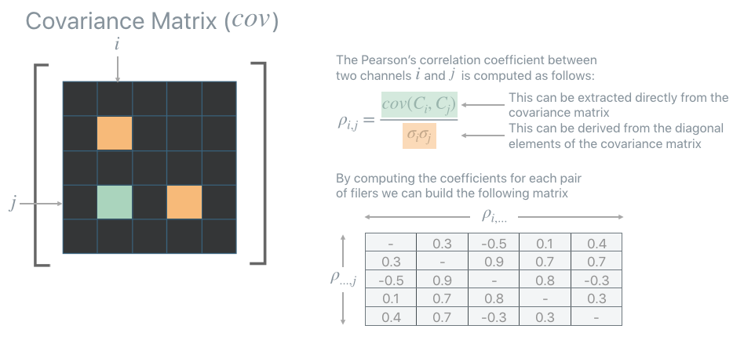

Once the correlation matrix is computed PFA provides two greedy strategies to identify which units are uncorrelated, and which units are redundant:
**ABS-Max** and **L1-Max**. When one of these strategies is employed the PFA recipe will contain also the indexes of the units
that PFA identifies as uncorrelated (or more precisely as least correlated).

.. image:: /img/pfa_recipe_with_fs.png
   :alt: Pandas DataFrame of PFA output showing columns of strategy type, layer name,
         original unit count, recommended unit count, and which unit indices recommended to keep.
   :align: center

ABS-Max
*******
ABS-Max identifies the pair of units with the highest amount of correlation (maximum absolute value
of among the correlation coefficients). In order to disambiguate which unit of the selected pair should be considered redundant,
it looks at the second highest, third highest, etc... coefficients until a choice can be made.

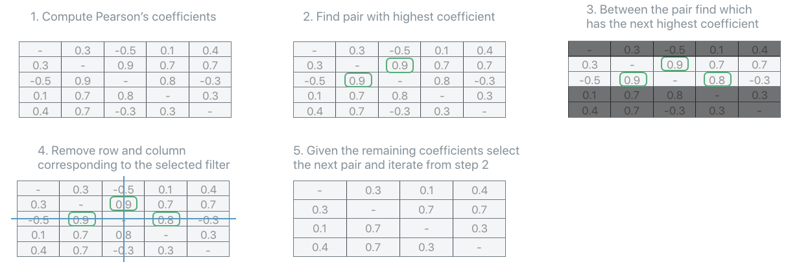

The code in order to use the ABS-Max unit selection strategy is:

.. code-block:: python

    recipe_dictionary = pfa.get_recipe(
        strategy=PFA.Strategy.SOME_STRATEGY,
        unit_strategy=PFA.UnitSelectionStrategy.AbsMax
    )

L1-Max
******

L1Max strategy iteratively selects as redundant the unit with the highest sum of all its correlation coefficients.
It identifies such unit as redundant, removes it from the correlation matrix, recompute the correlation matrix and iterates. In the rare, but theoretically possible, case that
more than one unit have the same L1 sum of the correlation coefficients, the strategy switches to ABS-Max to select
which unit should be considered redundant among the sub-set identified by the L1-Max strategy.

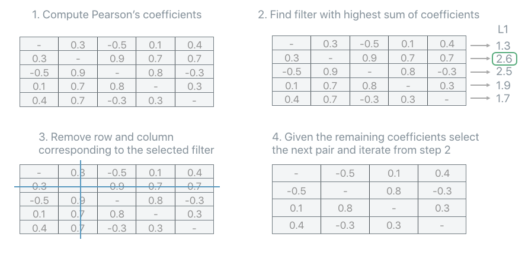

The code in order to use the L1-Max unit selection strategy is:

.. code-block:: python

    recipe_dictionary = pfa.get_recipe(
        strategy=PFA.Strategy.SOME_STRATEGY,
        unit_strategy=PFA.UnitSelectionStrategy.L1Max
    )

.. _pfa_description:

Description
-----------
Modern neural networks tend to be big, making them challenging to deploy in resource-constrained
devices. To reduce model size, network compression algorithms are often used.
However, these algorithms can be controlled by hyper-parameters that are difficult
to interpret and fine-tune. Compounding the problem, the size of each network layer is often
chosen arbitrarily by following simple conventions rather than evidenced principles.

Principal Filter Analysis (PFA) is a compression algorithm that
uses the data passing through a network to guide compression
and propose alternative architectures. It can be used to quantify
the correlation between units responses in a particular layer,
when performing inference on some relevant dataset (typically the training set).
PFA selects the dimension of the new layer, and optionally also which units should be preserved
(this can speed up the retraining), by eliminating units that are redundant
given the correlation found in the responses of such layer.
The hyper parameters of PFA are thoroughly documented and
relate to the final compressed model so characteristics such as footprint
or inference time can be quantified even before running the algorithm.

.. _pfa_evidence:

Evidence
^^^^^^^^
PFA applied to network compression shows considerable compression rates
without compromising accuracy, e.g., for VGG-16 on CIFAR-10, CIFAR-100
and ImageNet, PFA achieves a compression rate of 8x, 3x, and 1.4x with
an accuracy gain of 0.4%, 1.4% points, and 2.4% respectively. In
tests, it's also shown that networks compressed with PFA achieve an accuracy
that is very close to the empirical upper bound for a given compression ratio.

While most of the results in the PFA paper [1]_ are based on CNNs
and images, there are also successful results of PFA with non-image data using
RNNs as well as Transformers [2]_.

Algorithm
^^^^^^^^^

Principal Filter Analysis (PFA) [1]_ is an algorithm that, given a dataset and a trained model, it
introspects the responses of the model in order to identify units (i.e, filters in convolutional
layers or individual neurons in fully connected layers)
that produce correlated responses.

Correlation
***********

Most of the time the output of the last layer of neural networks is most interesting, however,
analyzing its intermediate responses provides a unique glimpse on how the network perceives
data throughout the different stages of the computation. Given a dataset, PFA analyzes the
responses of a layer and recommends a subset of units required to preserve the information
extracted by such layer while reducing redundancy among the units of the layer.

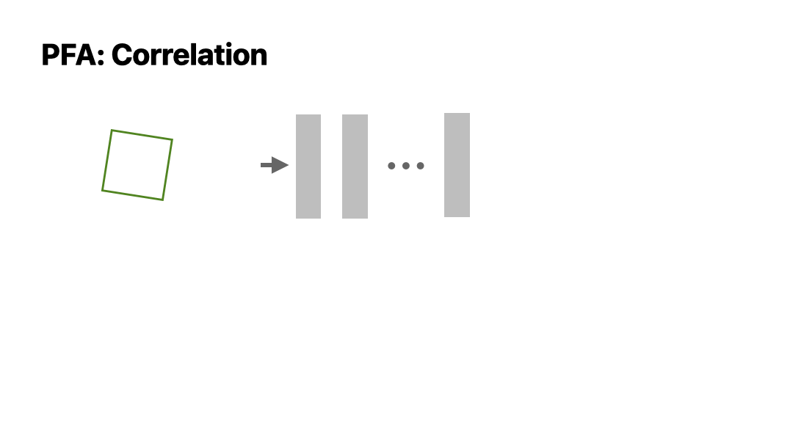
         data is fed through a model.
   :align: center

The *key* ingredient of PFA is the set of eigenvalues extracted from the empirical covariance
matrix computed from the responses.

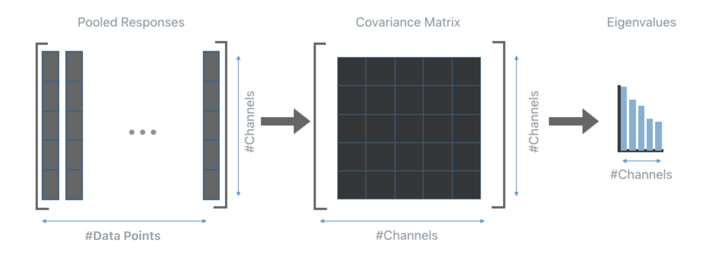

Intuitively, in the ideal scenario all eigenvalues should be equally distributed, on the other hand,
very small eigenvalues are indicative of a high amount of correlation among the responses, which in
turns, means that a smaller set of units should be able to produce responses that contain the same
amount of information as those produced by the current layer.

.. Note:: PFA can be applied to the output response of any layer with no knowledge of the training
  procedure or the loss function. All PFA needs are the responses generated by the current layer.

.. _pfa_suggested_workflow:

Suggested workflow
^^^^^^^^^^^^^^^^^^

This section describes how PFA can be applied to the layers of a trained model in order to extract
information about the correlation present in their responses.

**1**. Train a neural network.

**2**. Run inference using a random subset of the training set (or the whole training set if time
allows) and extract the responses of the layers that should be analyzed. It is the user who chooses
which layer to analyze, the analysis can target a specific layer, or include all convolutional and
fully connected layers. This step can be performed using any external
tool or with the DNIKit inference tools.

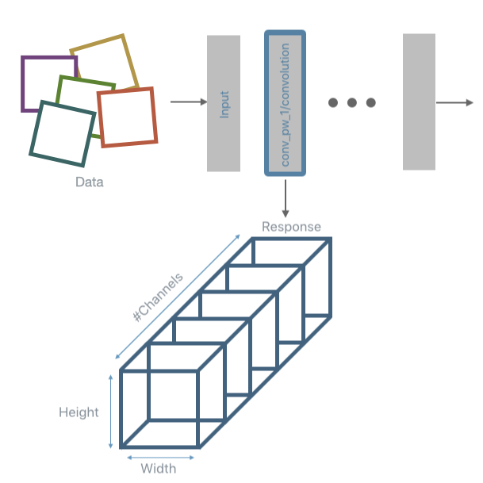
         number of channels, height, and width.
   :align: center

.. Note:: DNIKit supports models from several frameworks, to see the complete list of supported framework visit the
  :ref:`Installation` page. When using a non-supported framework, it's still possible to use PFA (as well as all other DNIKit
  introspectors) by running inference (step 2) and collecting the responses without the help of DNIKit. This then requires
  building a custom :class:`DNIKit Producer <dnikit.base.Producer>` to passes the responses to the PFA
  introspector or any other introspector (see :ref:`create a custom <creating_custom_producer>`).

..
    #LZ:  it would be great to have an example about this, also the DNIKit producer is currently berried inside the Data Management but it feels as it should be a first citizen of the DNIKit world

..
    **3**. Perform a dimensionality reduction of the responses. This step is optional, the only constraint is that the
    as long as the response matrix fed to PFA must be 2D and the second dimension must be equal to the number of filters
    (or neurons in a dense layer). In practice, pooling is often useful since the
    flattened responses can be very big. A common reduction algorithm is Max or Avg pooling but other options can be used
    (e.g., concatenation of Max and Avg or some spatial/temporal preserving pooling). Like for the previous step, DNIKit provides tools to
    perform this part of the pipeline (the most common pooling operations are already implemented, other can be implemented by extending a
    :ref:`Processor <Processors API>`, however, one can choose to pre-process the responses using external tools).

**3**. Perform a response reduction. This step is only needed for convolutional layers. Once the response from a
convolutional layer is obtained 1 value per each filter is extracted. A common reduction algorithm is
Max or Avg pooling. Like for the previous step, DNIKit provides tools to perform this part of the pipeline
(the most common pooling operations are already implemented, other can be implemented by extending a
:ref:`Processor <Processors API>`, however, one can choose to process the responses using external tools).

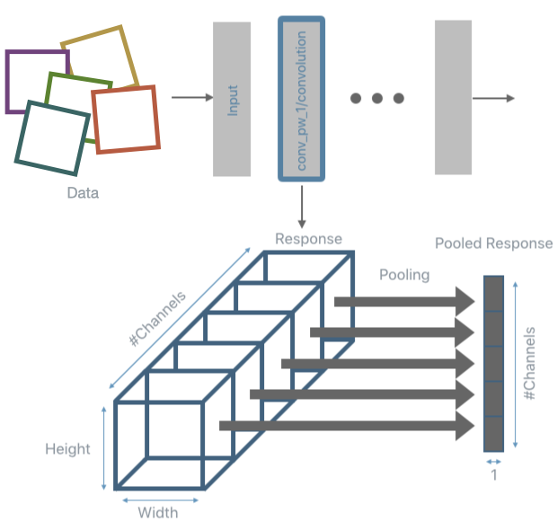

**4**. Run PFA to introspect the responses. For each layer under analysis, this step will build the empirical
covariance matrix and compute its eigenvalues. The code to compute this introspection is shown below:

.. code-block:: python

    pfa = PFA.introspect(
        producer=response_producer,
        batch_size=500
    )

**5**. Apply a PFA strategy in order to obtain a recipe that will indicate how many units are needed for each analyzed
layer in order to minimize correlation while achieving a specific *target*. The target depends on the strategy used. There are
three strategies available: **PFA Energy**, **PFA Size**, and **PFA KL**. See :Ref:`PFA Strategies` for details on each of the strategies.
Once PFA has performed the introspection step, a recipe can be obtained by requesting it with one of the strategies listed earlier. For
example, to use PFA Energy with an energy level of 0.7 but ensure that at least 3 units are always considered non-redundant the
code would be the following:

.. code-block:: python

    recipe_dictionary = pfa.get_recipe(
        strategy=PFA.Strategy.Energy(
            energy_threshold=0.7,
            min_kept_count=3
        )
    )

Up to this point, the recipe only specifies some information about the correlation found in the analyzed layers and
how many units are needed to minimize correlation while achieving the target specified by the strategy. No information
is yet provided regarding *which* units are the least redundant. Below is an example of the recipe produced by PFA:

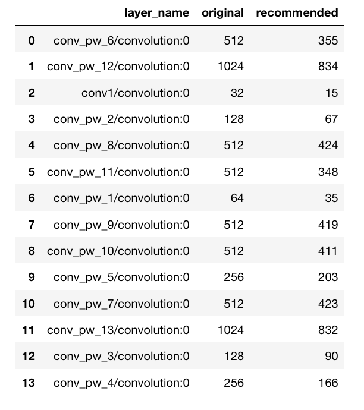
          original unit count, and recommended unit count.
    :align: center

In order to identify which units are identified as least redundant see the section about :ref:`Unit Selection`.

**6**. Use the information of the recipe. This steps depends on the target application.

.. Note:: The user is responsible for steps 1 and 6,
   while all the other steps can be done within DNIKit.

PFA for Transfer Learning
^^^^^^^^^^^^^^^^^^^^^^^^^
PFA can also be used for simultaneous compression and transfer learning by using the data of a
new target task as input to the algorithm, where the model was trained on a different original task.

In transfer learning usually a model pre-trained on some dataset (original task) is fine-tuned on
a different dataset (target task). Taking advantage of the first training has been shown to have
advantages especially if the dataset available for the target task is limited in size.
The problem with this approach is that the original model might contain much more information
than what is needed to solve the final task. This is fine if there are no constraints on memory
and inference time but it could become an issue if there are resource-constraints while also
wanting to take advantage of transfer learning.

PFA is an introspector that can be used to drive the compression by analyzing responses to a
specific dataset, rather than simply removing weights with small magnitude. Therefore, the
compressed networks become specialized for the dataset used to generate the responses: depending
on the dataset, the compressed architecture will change.

All is needed is to run PFA with the dataset that corresponds to the target task instead of the
original task. Running PFA on the target task will let the algorithm choose which part of the
network is most relevant for the final target task, and which part is
unnecessary, resulting in simultaneous compression and transfer learning.

To demonstrate the effectiveness of PFA in the task of simultaneous compression and transfer
learning, the following experiment has been performed.

Let :math:`D_a` denote the dataset that corresponds to the original task used for training the full
model. In this test, :math:`D_a` is CIFAR-100_. Let :math:`D_z` denote the dataset that corresponds
to the target task. Different :math:`D_z`s are generated by randomly sampling classes out
of the original 100 classes contained in CIFAR-100. Two targets :math:`D_z` of 10 classes each
(:math:`R_1` and :math:`R_2`) are generated, alongside four targets :math:`D_z` of 2 classes each
(:math:`S_1`, :math:`S_2`, :math:`S_3` and :math:`S_4`).
For each adaptation :math:`D_a` → :math:`D_z` the following experiments are performed using
a VGG-16 model:

.. _CIFAR-100: https://www.cs.toronto.edu/~kriz/cifar.html

* `Full scratch`: Train from scratch with the target task :math:`D_z` (this does not include transfer learning);
* `Full fine`: Train from scratch with the original task :math:`D_a` and fine-tune with :math:`D_z` (traditional transfer learning);
* `PFA scratch`: Train from scratch with the original task :math:`D_a`, run :ref:`PFA KL` with :math:`D_z` and train the compressed architecture from scratch with :math:`D_z`;
* `PFA fine`: Train from scratch with the original task :math:`D_a`, run :ref:`PFA KL` with :math:`D_z` and train the compressed architecture using :ref:`Unit Selection` with :math:`D_z`.

The results in the figure below show how the `PFA fine` strategy (red bars) performs similarly to
the `Full fine` model (green bars), while obtaining models that are more than 4 times smaller
(the footprint is indicated by the percentage values overlaid on top of the yellow and red bars).
Moreover, the `PFA fine` strategy significantly outperforms the full model trained from scratch on
the target domain (`Full scratch`, blue bars).

.. image:: ../../img/domain_c100.pdf
   :alt: Graphical version of the PFA results on simultaneous compression and transfer learning
         (accuracies).
   :align: center

The compressed architectures generated by PFA, shown in the image below, are different depending on
the complexity of the target task. Note how PFA obtains architectures with more filters for the
10 class subsets (:math:`R_1` and :math:`R_2`) than for the 2 class subset
(:math:`S_1`, :math:`S_2`, :math:`S_3` and :math:`S_4`). Even among the 2 class subset, there is a
small variation in the final architecture, reflecting the different level of difficulty to
distinguish between the two target classes. These results show how by analyzing the responses rather
than the weights, PFA is able to compress a network while specializing it to different target tasks.

.. image:: ../../img/domain_recipes_c100.pdf
   :alt: Graphical version of PFA results on simultaneous compression and transfer learning
         (architectures)
   :align: center

.. _pfa_example:

Example
-------
.. toctree::
   :maxdepth: 1

   Jupyter Notebook: Principal Filter Analysis (PFA) <../../notebooks/model_introspection/principal_filter_analysis.ipynb>

Relevant API
------------
- :class:`PFA Introspector <dnikit.introspectors.PFA>`
- :class:`PFA Compression Strategies <dnikit.introspectors.PFA.Strategy>`
- :class:`PFA Unit Selection Strategies <dnikit.introspectors.PFA.UnitSelectionStrategy>`
- :func:`PFA Recipe <dnikit.introspectors.PFA.get_recipe>`

.. rubric:: References

.. [1] Suau, X., Zappella, L., & Apostoloff, N. (2018). Filter Distillation for Network Compression. https://arxiv.org/pdf/1807.10585.pdf
.. [2] Hinton, G., Vinyals, O. & Dean, J. (2015). Distilling the Knowledge in a Neural Network. https://arxiv.org/pdf/1503.02531.pdf
